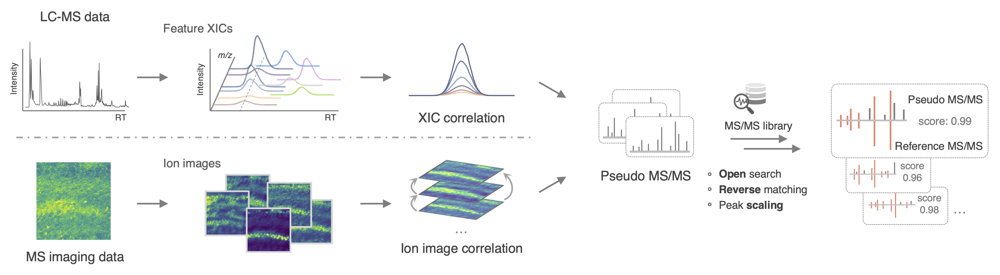
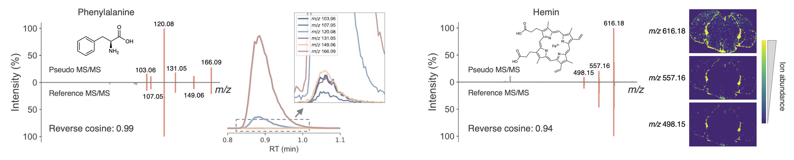

# Structure annotation of full-scan MS data
[](https://scholar.google.ca/citations?user=en0zumcAAAAJ&hl=en)


Full-scan MS data from both LC-MS and MS imaging capture multiple ion forms, including their in/post-source fragments. 
Here we leverage such fragments to structurally annotate full-scan data from **LC-MS** or **MS imaging** by matching against MS/MS spectral libraries.


## MS1 annotation
#### Workflow



#### Example annotations



## Run the workflow
- Clone the GitHub repository.
```bash
 git clone git@github.com:Philipbear/ms1_id.git
```
- Install the dependencies (Python 3.9+ required).
```bash
 pip install -r requirements.txt
```
- Run [`ms1id_lcms.py`](https://github.com/Philipbear/ms1_id/blob/main/ms1id_lcms.py) for LC-MS data, and [`ms1id_msi.py`](https://github.com/Philipbear/ms1_id/blob/main/ms1id_msi.py) for MS imaging data.

Indexed libraries are needed for the workflow. You can download the indexed GNPS library [here](https://github.com/Philipbear/ms1_id/releases/tag/v0.0.1). 
To build your own indexed library, run [`index_library.py`](https://github.com/Philipbear/ms1_id/blob/main/index_library.py).


## Citation

> Shipei Xing, Vincent Charron-Lamoureux, Yasin El Abiead, Pieter C. Dorrestein. Annotating full-scan MS data using tandem MS libraries. [biorxiv 2024](https://www.biorxiv.org/content/10.1101/2024.10.14.618269v1).


## Data
- GNPS MS/MS library
  - [ALL_GNPS_NO_PROPOGATED.msp](https://external.gnps2.org/gnpslibrary), downloaded on July 17, 2024
  - Indexed version [available here](https://github.com/Philipbear/ms1_id/releases/tag/v0.0.1)
- LC-MS data
  - Pooled chemical standards ([GNPS/MassIVE MSV000095789](https://massive.ucsd.edu/ProteoSAFe/QueryMSV?id=MSV000095789))
  - NIST human feces ([GNPS/MassIVE MSV000095787](https://massive.ucsd.edu/ProteoSAFe/QueryMSV?id=MSV000095787))
  - IBD dataset ([original paper](https://www.nature.com/articles/s41586-019-1237-9), [data](https://www.metabolomicsworkbench.org/data/DRCCMetadata.php?Mode=Project&ProjectID=PR000639))
- MS imaging data
  - Mouse brain ([original paper](https://www.nature.com/articles/nmeth.4072), [data](https://www.ebi.ac.uk/metabolights/editor/MTBLS313))
  - Mouse body ([METASPACE dataset](https://metaspace2020.eu/dataset/2022-07-08_20h45m00s))
  - Hepatocytes ([METASPACE dataset](https://metaspace2020.eu/project/Rappez_2021_SpaceM))


## License
This project is licensed under the Apache 2.0 License.